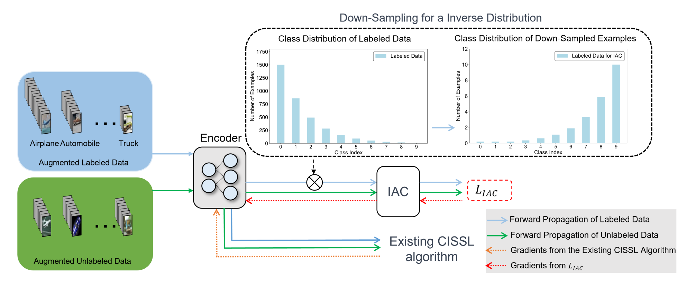

<div id="top"></div>
<!--
*** Thanks for checking out the Best-README-Template. If you have a suggestion
*** that would make this better, please fork the repo and create a pull request
*** or simply open an issue with the tag "enhancement".
*** Don't forget to give the project a star!
*** Thanks again! Now go create something AMAZING! :D
-->

<!-- PROJECT SHIELDS -->

<!--
*** I'm using markdown "reference style" links for readability.
*** Reference links are enclosed in brackets [ ] instead of parentheses ( ).
*** See the bottom of this document for the declaration of the reference variables
*** for contributors-url, forks-url, etc. This is an optional, concise syntax you may use.
*** https://www.markdownguide.org/basic-syntax/#reference-style-links

<div align="center">

<!-- <h3 align="center">Class-Imbalanced Semi-Supervised Learning with Inverse Auxiliary Classifier</h3> -->

<p align="center">
    <a href="https://papers.bmvc2023.org/0908.pdf">Class-Imbalanced Semi-Supervised Learning with Inverse Auxiliary Classifier
    <!-- <br /> -->
</a>
  </p>
</div>


<!-- Introduction -->


## Introduction

This is the implementation of **IAC** described in "Class-Imbalanced Semi-Supervised Learning with Inverse Auxiliary Classifier." The code is based on <a href="https://github.com/microsoft/Semi-supervised-learning/">USB </a>.

## Model Structure



<p align="right">(<a href="#top">back to top</a>)</p>


<!-- GETTING STARTED -->

## Getting Started

This is an example of how to set up this implemention locally.
To get a local copy up, running follow these simple example steps.

### Prerequisites

IAC is based on USB, which is built on pytorch, with torchvision, torchaudio, and transformers.

To install the required packages, you can create a conda environment:

```sh
conda create --name iac python=3.8
```

then use pip to install required packages:

```sh
pip install -r requirements.txt
```

From now on, you can start a CISSL model by CReST+IAC by typing 

```sh
python train.py --c config/classic_cv_imb/fixmatch_crest_iac/fixmatch_crest_iac_cifar10_lb500_100_ulb4000_100_0.yaml
```

### Development

You can also develop your own CISSL algorithm and evaluate it by cloning UAC:

```sh
git clone https://github.com/jts250/The-Implementation-of-IAC.git
```

<p align="right">(<a href="#top">back to top</a>)</p>


### Prepare Datasets

The detailed instructions for downloading and processing are shown in [Dataset Download](https://github.com/microsoft/Semi-supervised-learning/tree/main/preprocess). Please follow it to download datasets before running or developing algorithms, which are consistent with USB.

<p align="right">(<a href="#top">back to top</a>)</p>


### Training

Here's an example of training FixMatch with CReST+IAC on the CIFAR-10 dataset, where the class with the highest number of samples has 500 samples.
Training other supported algorithms (on other datasets with different label settings) can be specified by a config file:

```sh
python train.py --c --c config/classic_cv_imb/fixmatch_crest_iac/fixmatch_crest_iac_cifar10_lb500_100_ulb4000_100_0.yaml
```

### Evaluation

After training, you can check the evaluation performance on training logs, or running evaluation script:

```
python eval.py --c config/classic_cv_imb/fixmatch_crest_iac/fixmatch_crest_iac_cifar10_lb500_100_ulb4000_100_0.yaml --load_path /PATH/TO/CHECKPOINT
```


<!-- CONTACT -->

## Contact

If you have any problem, welcome to contact:

- Tiansong Jiang (jiangtiansong@njust.edu.cn), Nanjing University of Science and Technology

<p align="right">(<a href="#top">back to top</a>)</p>

<!-- CITE -->

## Citing USB

Please cite us if you fine this project helpful for your project/paper:

```
@article{jiang2023class,
  title={Class-Imbalanced Semi-Supervised Learning with Inverse Auxiliary Classifier},
  author={Jiang, Tiansong and Wan, Sheng and Gong, Chen},
  year={2023}
}}
```

<!-- ACKNOWLEDGMENTS -->

## Acknowledgments
We thanks the following projects for reference of creating IAC:

- [USB](https://github.com/microsoft/Semi-supervised-learning/)
- [TorchSSL](https://github.com/TorchSSL/TorchSSL)
- [FixMatch](https://github.com/google-research/fixmatch)
- [CoMatch](https://github.com/salesforce/CoMatch)
- [SimMatch](https://github.com/KyleZheng1997/simmatch)
- [HuggingFace](https://huggingface.co/docs/transformers/index)
- [Pytorch Lighting](https://github.com/Lightning-AI/lightning)
- [README Template](https://github.com/othneildrew/Best-README-Template)

<p align="right">(<a href="#top">back to top</a>)</p>

<!-- MARKDOWN LINKS & IMAGES -->

<!-- https://www.markdownguide.org/basic-syntax/#reference-style-links -->
